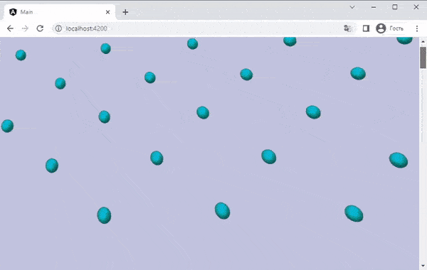

# AttachNodeToScroll

AttachNodeToScroll is a behavior for Babylon.js that allows you to attach a node to a scrolling element. It provides an easy way to create scroll-based animations for your Babylon.js scenes.



## Installation

To install AttachNodeToScroll, simply run:

```bash
npm install attach-node-to-scroll
```

## Usage

Here's an example of how to use AttachNodeToScroll:

```ts
import { AttachNodeToScroll } from 'attach-node-to-scroll';
import { SceneLoader } from '@babylonjs/core';

// Import our scene with animated camera
SceneLoader.Append('/assets/', 'myScene.gltf', this.scene, scene => {
  // Find last camera in scene
  const myCam = scene.cameras[scene.cameras.length - 1];

  if (myCam) {
    // If camera exists, make it active
    scene.activeCamera = myCam;
    
    // Camera animated by it's parent position and rotation
    // so we need to get the parent of the camera
    const animatableNode = myCam.parent;

    if (animatableNode) {
      // If element exists, attach it to the scroll by behavior class
      const attachNodeToScroll = new AttachNodeToScroll();
      animatableNode.addBehavior(attachNodeToScroll);
    }
  }
});
```

And you can customize the behavior by passing in an options object:

```ts
const attachNodeToScroll = new AttachNodeToScroll({
  scrollElement: document.getElementById('scrollable')!,
  scrollDirection: 'horizontal',
  onBeforeUpdate: (progress) => {
    return progress * 1.1;
  }
});
animatableNode.addBehavior(attachNodeToScroll);
```

## Options

- `scrollElement` - The element to attach to. Defaults to `window`.
- `scrollDirection` - The direction to scroll in. Defaults to `vertical`.
- `onBeforeUpdate` - A function that is called before the node is updated. This function is passed the progress value and should return the progress value to use.

## Contributing
Contributions are welcome! If you'd like to contribute to this project, please follow the standard Gitflow workflow and submit a pull request.
